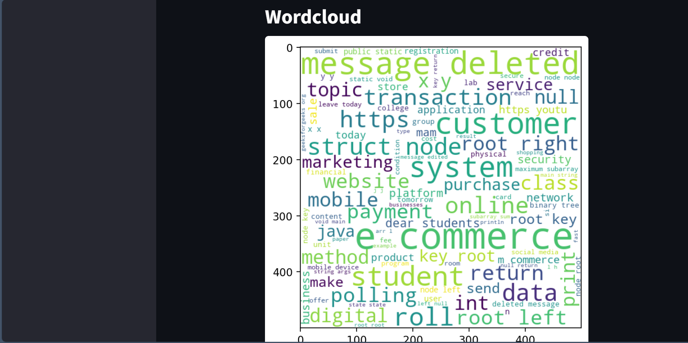
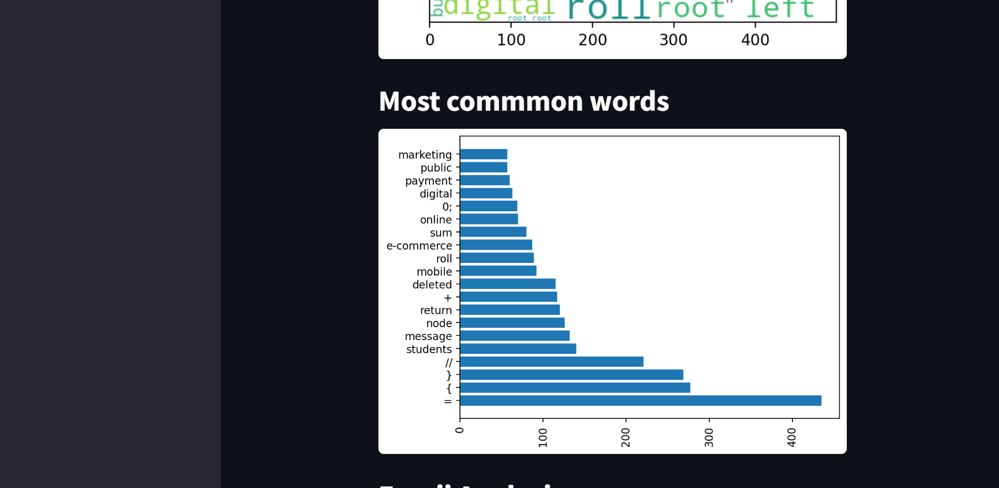

# WhatsApp Chat Analyzer

  A powerful and intuitive Python-based web application built with Streamlit for insightful analysis of your WhatsApp chat data. Upload your chat export and gain instant statistics, interactive visualizations, and trend insights.

## ✨ Features

* **Comprehensive Statistics:** Get quick summaries including total messages, word count, media files shared, and external links exchanged.
* **User Activity Analysis:** Identify your most active chat participants and visualize daily and monthly communication patterns.
* **Monthly & Daily Timelines:** Understand chat frequency and trends over time.
* **Activity Maps:** See the busiest days of the week and months for your selected chat.
* **Word Cloud Generation:** Visualize the most frequently used words in your chats, with intelligent filtering for common Hinglish stop words.
* **Most Common Words:** View a ranked list of the top 20 most frequent non-stop words.
* **Emoji Analysis:** Discover the most used emojis and their distribution within your conversations.
* **Interactive Interface:** A user-friendly Streamlit interface for easy file upload and selection of specific users for analysis.

## 🚀 Technologies Used

* Python
* [Streamlit](https://streamlit.io/) - For building the interactive web application.
* [Pandas](https://pandas.pydata.org/) - For data manipulation and analysis.
* [Matplotlib](https://matplotlib.org/) - For generating various plots and charts.
* [Urlextract](https://pypi.org/project/urlextract/) - For extracting URLs from messages.
* [WordCloud](https://pypi.org/project/wordcloud/) - For generating word clouds.
* [Emoji](https://pypi.org/project/emoji/) - For handling and analyzing emojis.

## ⚙️ How to Use (Local Setup)

Follow these steps to run the WhatsApp Chat Analyzer on your local machine:

1.  **Clone the Repository:**
    ```bash
    git clone [https://github.com/raghavsandhya2dnu/WhatsApp-Chat-Analyzer.git)
    ```
2.  **Navigate to the Project Directory:**
    ```bash
    cd whatsapp-chat-analyzer
    ```
3.  **Create a Virtual Environment (Recommended):**
    ```bash
    python -m venv venv
    source venv/bin/activate  # On Windows: `venv\Scripts\activate`
    ```
4.  **Install Dependencies:**
    Ensure you have a `requirements.txt` file in your project root. If not, generate one by running `pip freeze > requirements.txt` after installing all necessary libraries.
    ```bash
    pip install -r requirements.txt
    ```
5.  **Run the Streamlit Application:**
    ```bash
    streamlit run streamlit_app.py
    ```
6.  **Export Your WhatsApp Chat:**
    * Open the WhatsApp chat you want to analyze.
    * Tap the three dots (More options) -> More -> Export chat -> **Without Media**.
    * This will generate a `.txt` file.
7.  **Upload the Chat File:**
    * In the running Streamlit app (usually opens in your browser), use the sidebar to upload the exported `.txt` file.
    * Select "Show Analysis" to view the insights!

## 🌐 Live Demo

You can try out the live version of the application here:
[https://your-deployed-app-link.streamlit.app/](https://huggingface.co/spaces/SandhyaRaghav/whatsapp-chat-analyzer) 

## 🤝 Contributing

Contributions are welcome! If you have suggestions for improvements or new features, please feel free to:
1.  Fork the repository.
2.  Create a new branch (`git checkout -b feature/YourFeature`).
3.  Make your changes.
4.  Commit your changes (`git commit -m 'Add YourFeature'`).
5.  Push to the branch (`git push origin feature/YourFeature`).
6.  Open a Pull Request.

## ✉️ Contact

If you have any questions or feedback, feel free to reach out:

* **Email:** sandhyaraghav888.email@email.com

---
